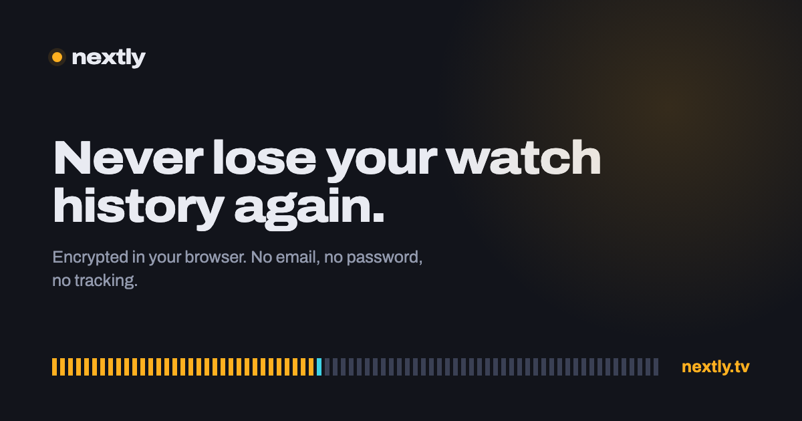

# nextly



[nextly.tv](https://nextly.tv) — a TV show tracker where you keep the data. No email, no
password, no tracking.

Your episodes are encrypted in the browser before they leave it. The server stores one
opaque blob per account and a hash — it cannot read either, and neither can anyone who
takes the database. Self-host it, or export a plain JSON file and walk away.

Built the same way as [nestegg.money](https://github.com/VladimirWrites/nestegg.money):
a Cloudflare Worker, D1, and native ES modules with no bundler.

## Why it exists

Tracking services shut down and take watch histories with them. Four design decisions
follow from refusing that:

**The server can't read your data.** An account number derives two values: a SHA-256 hash
the server uses as a row key, and — from a different input string, via PBKDF2 — an AES-GCM
key that never leaves the browser. There's no password reset because there's nothing to
reset against.

**Your history is readable without any catalogue.** Each show is stored with its name,
year, IMDb id and TheTVDB id, and each watch mark is a plain `"3x7"`. So a raw export says
`Breaking Bad (2008) · tt0903747 · 3x7` — legible to a human, and re-resolvable against any
catalogue that still exists. Nothing depends on one provider's numeric ids surviving.

**Catalogues are swappable.** `public/js/io/providers/` holds one file per catalogue, each
normalizing to a shared shape. Adding one is a file; losing one costs a file.

**No address names a show.** A path is sent to the server on every navigation that reaches
the network — a refresh, a cold start, a restored tab, a link someone opened — so
`/show/tmdb:67070` would tell whoever runs the server which programme an address is watching.
That is exactly the fact the encryption exists to withhold, and it was sitting in the one place
nobody thought to look. The subject goes in the fragment instead: `/show#tmdb:67070`. A
fragment is the only part of a URL a browser never transmits, to the origin or to anything in
front of it. The server sees `/show` and learns that somebody opened a show page, which is
nothing. `domain/routes.js` is that decision, on its own and tested, and there is no longer a
shape of address that carries a subject anywhere else.

## Running it

```bash
npm install
```

```bash
npm run dev
```

That is enough to use it: `/app` serves the app and `/site` the landing page, on one
hostname, against a local D1. No API key is needed — TVmaze is the default catalogue and
needs no credentials.

The service worker deliberately stays out of the way on `localhost`, so edits show up on
one reload instead of two.

### Self-hosting

`wrangler.toml` points at the database and the two hostnames this instance uses. For your
own, create a database and put its id in place of the one there:

```bash
npx wrangler d1 create nextly-db
```

```bash
npm run db:init
```

```bash
npm run deploy
```

Change the `[[routes]]` patterns to your own names — both of them, since the app host and the
site host are separate DNS records; attaching the apex does not create the subdomain. The
Worker treats any hostname starting `app.` as the app.

If the promise in this README matters to you, self-hosting is how you stop having to take my
word for it. See [SECURITY.md](SECURITY.md) for what that does and does not change.

## Tests

```bash
npm test
```

411 tests over the domain logic, the crypto, the provider normalizers, the vault API and the
Worker's routing — Node's own runner, no browser, no dependencies. The ones worth reading
first are `tests/merge.test.mjs` and `tests/rewatch.test.mjs`: every real two-device
scenario, including the ones that would silently lose an episode.

## Layout

The site and the app are two documents on two hostnames, because they have opposite jobs:
`nextly.tv` exists to be read by strangers and indexed, `app.nextly.tv` is a locked door
with nothing to show. Keeping them apart means the app never carries marketing copy and the
site never loads the app.

```
src/index.js              Worker: /api/vault, host routing, SPA fallback
schema.sql                D1: vaults + a create-rate-limit log

public/index.html         the public site        (nextly.tv)
public/app.html           the app                (app.nextly.tv)
public/privacy.html       privacy policy
public/terms.html         terms

public/js/domain/         Pure logic. No DOM, no network, no clock it wasn't handed.
  constants.js              keys and codes: "tvmaze:169", "3x7", "S03E07"
  schema.js                 state shape, migration, record normalization
  merge.js                  per-record multi-device merge + tombstones
  progress.js               counts, next-up, and what the barcode draws
  schedule.js               what's coming: unaired episodes by date
  model.js                  every mutation that touches the vault
  dates.js                  air dates, "is this still to come?", relative time
  labels.js                 the words a show's state produces
  stats.js                  what the marks add up to
  scores.js                 per-episode ratings, and the season's shape
  share.js                  parsing whatever another app shared with us
  discover.js               ranking what's on into something worth showing
  routes.js                 what an address means, and what address a screen has
  store.js                  the one live state object

public/js/io/             Effects.
  crypto.js                 account numbers, key derivation, gzip + AES-GCM
  storage.js                localStorage + vault sync with conflict retry
  cache.js                  IndexedDB metadata cache (never in the vault)
  meta.js                   catalogue interface
  discover.js               discovery feeds, cached for six hours
  providers/tvmaze.js       default — no key
  providers/tmdb.js         optional — your own key

public/js/ui/             DOM. One file per screen, plus a few shared pieces.
  dom.js                    the element builder, toasts, media that outlives a render
  barcode.js                the strip
  discover.js               the rows on Search, and what each one is
  feed.js                   one of those rows in full, a page at a time
  show.js                   a show you track …
  show-preview.js           … one you have only found …
  show-parts.js             … and everything both pages are built from
  show-seasons.js           the season list, which builds itself lazily
  trail.js                  which visits are still reachable, and where they were
  viewstate.js              what each visit had open
public/js/main.js         boot + routing

public/lib/limits.js      the one ceiling both the client and the Worker check

public/css/base.css       tokens, type, and the primitives both documents share
public/css/app.css        app components
public/css/site.css       public site + legal pages
```

Locally there is only one hostname, so both documents are reachable by path: `/` serves the
site, `/app` serves the app.

## How sync works

Every device keeps the full state locally and pushes the whole encrypted blob. Two things
stop that from losing data:

1. **Optimistic concurrency.** A push carries the `updated_at` it last saw. If the row has
   moved on, the Worker answers `409` with the current blob; the client merges and retries.
2. **Per-record merge.** A show is a parent record and each watch mark is its own child, so
   two devices marking different episodes both win. Same episode on both: newest wins.
   Unwatching writes a tombstone, so a device holding the old mark can't resurrect it.

A mark exists if and only if you've watched the episode at least once, which is why
unwatching a first viewing has to be a deletion, and why the tombstones matter. Raising a
mark's rewatch level is an ordinary edit, so it re-stamps the mtime and merges newest-wins
like anything else.

## Rewatches

A show can be watched more than once, and the app tracks which time through you're on.

`show.rw` is the pass in progress; `entry.n` is the pass an episode was last watched in.
Marking sets `n = rw` rather than incrementing, which keeps it idempotent — two devices
marking the same episode of the same pass agree instead of racing to 3. Both fields are
omitted when they're 1, so a library nobody has rewatched stores exactly what it stored
before rewatches existed.

Everything else falls out of comparing the two: next up is the lowest aired episode with
`n < rw`, progress counts episodes at `n >= rw`, and "times through" is the lowest level
across everything that has aired. Starting a pass is an explicit **Watch again** — never a
side effect of tapping an episode you'd already marked, because that tap means you
mis-marked it. Unmarking during a rewatch steps the level down instead of deleting: you did
still watch it the first time.

## Coming up

Every unaired episode of everything you track, grouped by date, on the Up next screen —
"Silo S03E05 · Fri 31 Jul · in 2 days".

This costs no extra network call. Catalogues ship announced-but-unaired episodes in the same
payload as everything else, air dates included, so `domain/schedule.js` is a query over
metadata the cache already holds — and it works offline. Dropped shows are the only ones
left off; a paused show coming back next week is exactly when you'd unpause it.

The horizon is 120 days, because catalogues occasionally carry a placeholder date years out.
Anything past it is reported as a count rather than silently dropped.

## Finding something new

An empty search box is a dead end, so Search opens on rows of what's worth starting. Which
rows depends on the catalogue in use, because a card opens a show under its catalogue's episode
numbering and a mixed screen would hand back TVmaze shows to someone who chose TMDB.

Every row ends in a card that opens the whole feed, a page at a time. The two sides of that
work differently and the screen deliberately can't tell: TMDB pages on the server, twenty at a
time, and reports how many pages exist — which is passed on rather than inferred, since a short
page is no proof of the end when the last page of an exact multiple of twenty is full. The
TVmaze rows are computed here from a schedule window this client already holds, so page one is
all of it: the row shows two dozen and the full screen lifts that limit without another
request.

## The barcode

One tick per episode, grouped by season: amber watched, one cyan tick for the episode
you'd play next, neutral for aired-and-unwatched, faint for unaired. It costs a progress
bar's worth of space and tells you where you stopped, what you skipped, and how much is
left — the shape of a show's history rather than a percentage of it.

During a rewatch a fifth state appears: episodes seen on an earlier pass draw as half-height
amber, so the previous run shows through underneath the current one instead of vanishing the
moment you start again.

## Why it looks like this

The reasoning behind the parts that would otherwise look arbitrary — why merge has to be
symmetric, why a screen visited twice is two places, why the barcode disappears on very long
shows, why cast is never stored — is in **[docs/DECISIONS.md](docs/DECISIONS.md)**.

Most of it was learned by getting it wrong first, and it is written down because that is the
expensive part. The code can be read from the code.

## Contributing

See [CONTRIBUTING.md](CONTRIBUTING.md). The short version: logic that decides something lives
in `domain/` and has tests; views draw and do not decide. There is no build step and no
runtime dependency, and both are deliberate.

## Security

The claim is that the server cannot read your watch history.
**[SECURITY.md](SECURITY.md)** says exactly what that means, what it does not cover — the
biggest limit being that we also serve the JavaScript holding your key — and where to report
a break.

## Attribution

Show data from [TVmaze](https://www.tvmaze.com) and, optionally,
[TMDB](https://www.themoviedb.org). This product uses the TMDB API but is not endorsed or
certified by TMDB. TVmaze's API is free for non-commercial use.

The Archivo typeface is by Omnibus-Type under the SIL Open Font License 1.1; the licence
travels with the files at [public/fonts/OFL.txt](public/fonts/OFL.txt).

## Standing caveats

- The privacy policy and terms are written to be honest and readable. They are not vetted
  legal documents, and anyone hosting this for other people should have someone qualified
  read them.
- Germany requires an imprint under § 5 DDG for services offered *geschäftsmäßig*. A free,
  non-commercial project has a defensible argument that it does not apply, but the line is
  not bright.
- Nothing here has been audited by anyone.

## Support

nextly is free, has no ads and no tracking, and nothing is held back for a paid tier. If it
is useful to you and you would like to put something towards the bills, there is
[a tip jar](https://buymeacoffee.com/vladimirj.dev). Entirely optional, and it changes nothing
about the app either way.

## License

Apache-2.0 — see [LICENSE](LICENSE) and [NOTICE](NOTICE).
